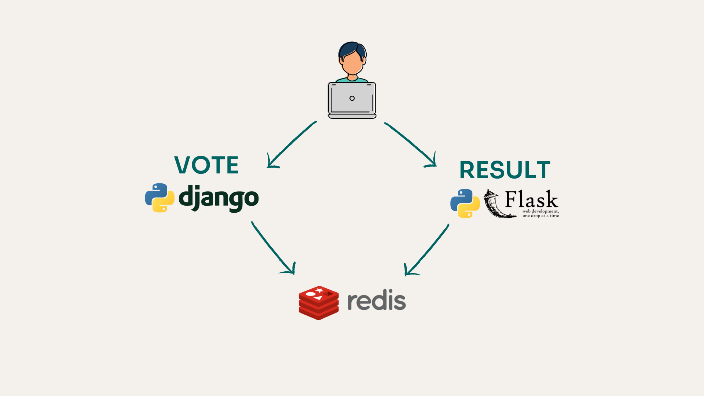

# README.md

Este repositório contem uma reprodução da aplicação voting disponibilizada pela Docker.
O link do repositório está [aqui](https://github.com/dockersamples/example-voting-app).  

A ideia de desenvolver do zero foi possibilitar o aluno uma visão completa de todo o processo de desenvolvimento e permitir que o mesmo consiga criar o Dockerfile e fazer o Deploy da aplicação.

## Arquitetura

Essa arquitetura tem como objetivo validar todos os conhecimentos do aluno:
- Gerenciamento de containers
- Gerenciamento de redes
- Gerenciamento de volumes
- Gerenciamento de imagens
- Docker compose
- Orquestração de container com Docker Swarm

> Lembre-se: deve haver comunicação entre os componentes para a aplicação funcionar.

- voting-app foi desenvolvido em Django e coleta os votos;
- redis armazena em cache os votos;
- result-app foi desenvolvido em Flask e exibe o resultado dos votos;